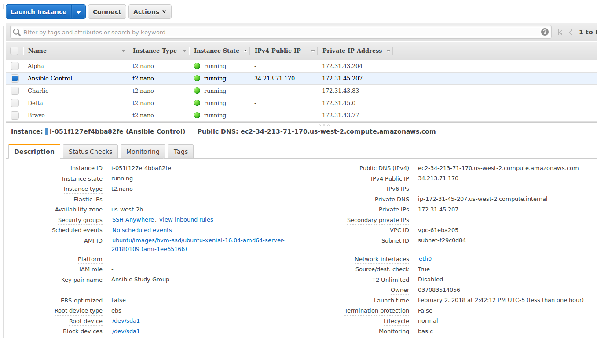

:toc:
:toc-placement!:

:note-caption: :information_source:
:tip-caption: :bulb:
:important-caption: :heavy_exclamation_mark:
:warning-caption: :warning:
:caution-caption: :fire:

= Ansible Study Group Labs
Ron Kurr <rkurr@jvmguy.com>

toc::[]

== Overview
This project is a collection of hands on labs showcasing the use of Ansible.  Unlike other study groups, the learners will have to solve problems with minimal guidance.

TIP: Each lab exercises what was showcased in the video assignments so many of your questions are probably already answered in the video.

IMPORTANT: Each lab builds on the prior ones, so if you are absent from a meeting you need to finish the lab before you can begin any new ones.

== Prerequisites

* an https://aws.amazon.com/[AWS] account
* an SSH client
* familiarity with https://aws.amazon.com/ec2/[EC2]

IMPORTANT: we will be using the same EC2 instances for the labs so always have your SSH key available when we meet.

TIP: Learners running Windows have had good success with http://gitforwindows.org/[Git BASH].

== Lab 01: Setting Up The Testing Environment
In order to give Ansible inventory to work on, we need to setup several small EC2 instances.  In your Amazon account, create the following:

. a new SSH key pair
. an Ubuntu `t2.nano` instance named Ansible Control
. an Ubuntu `t2.nano` instance named Alpha
. an Ubuntu `t2.nano` instance named Bravo
. an Amazon Linux `t2.nano` instance named Charlie
. an Amazon Linux `t2.nano` instance named Delta

IMPORTANT: Ensure that the security group on the instances allows inbound SSH access (port 22).

IMPORTANT: All instances need to have *both* a public and private ip address or packages management will not work!

TIP: Store your SSH keys on a USB stick so you can use different computers to connect to your control instance.

CAUTION: Remember to not use your root account when setting things up.  An Administrator IAM account is highly recommended.

Ansible uses SSH so we need to verify SSH is working as required.

. copy the private half of your SSH key to the control box
. from the control box, ensure you can SSH into Alpha
. from the control box, ensure you can SSH into Bravo
. from the control box, ensure you can SSH into Charlie
. from the control box, ensure you can SSH into Delta
. stop all of your instances

TIP: The `scp` command can be used to upload the key file.

IMPORTANT: SSH is very picky about file permissions so remember to set the proper permissions on the key prior to use.

.AWS Console

== Lab 02: Installing Ansible
. Install the Ansible PPA on the Ansible control box.
. Have Ansible print its version to verify the installation

TIP: The video has the steps as does the Ansible documentation. The documentation is easier to follow.

.Example Output
----
ansible 2.4.3.0
  config file = /etc/ansible/ansible.cfg
  configured module search path = [u'/home/ubuntu/.ansible/plugins/modules', u'/usr/share/ansible/plugins/modules']
  ansible python module location = /usr/lib/python2.7/dist-packages/ansible
  executable location = /usr/bin/ansible
  python version = 2.7.12 (default, Dec  4 2017, 14:50:18) [GCC 5.4.0 20160609]
----

IMPORTANT: Ansible requires that Python2 be installed on all the target machines or many of the modules will not work. On the `Alpha` and `Bravo` install the `software-properties-common` and `python` packages. `Charlie` and `Delta`, being Amazon Linux, already have Python installed.

== Lab 03: Configuring Ansible
. use the `ansible` command to apply the `ping` module to the `alpha` box.  Do *not* use a `hosts` or `ansible.cfg` file, specifying the information using command-line switches instead.
. create an `ansible.cfg` file, specifying the location of your private SSH key
. apply the `ping` module again, using the `ansible.cfg` file this time

TIP: When specifying inventory on the command line, makes sure to have a trailing comma `,`

TIP: Format of the configuration file http://docs.ansible.com/ansible/latest/intro_configuration.html[can be found here].

TIP: Read the documentation to see exactly where configuration files are read from

.Example Output
----
172.31.35.226 | SUCCESS => {
    "changed": false,
    "ping": "pong"
}
----

== Lab 04: Understanding Inventory
. create a `hosts` file with two groups.  One named `ubuntu` and one named `amazon`,  Put `alpha` and `bravo` in the `ubuntu` group and `charlie` and `delta` in the `amazon` group
. apply the `ping` module again, using the `hosts` file this time
. apply the `ping` module, but only to the `ubuntu` group
. apply the `ping` module, but only to the `amazon` group
. create a `blue` group with `alpha` and `charlie` as members and a `green` group with `bravo` and `delta` as members
. apply the `ping` module, but only to the `blue` group
. apply the `ping` module, but only to the `green` group
. apply the `ping` module to the `all` group

TIP: Remember, Ubuntu boxes use `ubuntu` as the user name and Amazon Linux uses `ec2-user`

TIP: A best practice is to specify your machines at the top of the inventory file and create the groups by referencing the machine names.  This avoids duplication of information, easing maintenance.

.Example Output
[source,json]
----
delta | SUCCESS => {
    "changed": false,
    "ping": "pong"
}
charlie | SUCCESS => {
    "changed": false,
    "ping": "pong"
}
bravo | SUCCESS => {
    "changed": false,
    "ping": "pong"
}
alpha | SUCCESS => {
    "changed": false,
    "ping": "pong"
}
----

== Lab 05: Disabling SSH Key Verification
The first time you ssh into a box, you are presented with this warning:

----
The authenticity of host '172.31.43.113 (172.31.43.113)' can't be established.
ECDSA key fingerprint is SHA256:CKohzQOoCI3Gx1rHRBuMgoXfqdPS+gFPCUHbubc/OIc.
Are you sure you want to continue connecting (yes/no)?
----

This is to prevent man-in-the-middle attacks.  Although more secure, this warning does not work well in automated environments.  This is especially true in a cloud environment where machines come and go on an hourly basis.

Modify your `ansible.cfg` file to disable this warning.  To simulate visiting a machine for the first time, test your changes by always removing the `known_hosts` file.  For example,

----
rm -f ~/.ssh/known_hosts && ansible ...
----

You have completed the lab if you can ping all hosts and never see the warning.

----
delta | SUCCESS => {
    "changed": false,
    "ping": "pong"
}
charlie | SUCCESS => {
    "changed": false,
    "ping": "pong"
}
bravo | SUCCESS => {
    "changed": false,
    "ping": "pong"
}
alpha | SUCCESS => {
    "changed": false,
    "ping": "pong"
}
----

== Lab 06: Imply The Inventory File Location
In the previous labs, we have been specifying the inventory file to use.  To simplify the commands, let's tell Ansible which inventory file to use.

Modify `ansible.cfg` so that the inventory file is implied.  You have completed the lab if all hosts can have the `ping` module applied without specifying the inventory file on the command-line.

----
delta | SUCCESS => {
    "changed": false,
    "ping": "pong"
}
charlie | SUCCESS => {
    "changed": false,
    "ping": "pong"
}
bravo | SUCCESS => {
    "changed": false,
    "ping": "pong"
}
alpha | SUCCESS => {
    "changed": false,
    "ping": "pong"
}
----

== Lab 07: Specify Log File Location
Ansible emits a log of the work it performs and you can control the location of that file.

Modify `ansible.cfg` so that the log file is created in the current directory.  You have completed the lab if after you `ping` all hosts, you have a file named `ansible.log` in the current directory and it contains text similar to this:

----
2018-02-07 00:06:51,516 p=32528 u=ubuntu |  delta | SUCCESS => {
    "changed": false,
    "ping": "pong"
}
2018-02-07 00:06:51,538 p=32528 u=ubuntu |  bravo | SUCCESS => {
    "changed": false,
    "ping": "pong"
}
2018-02-07 00:06:51,549 p=32528 u=ubuntu |  alpha | SUCCESS => {
    "changed": false,
    "ping": "pong"
}
2018-02-07 00:06:51,556 p=32528 u=ubuntu |  charlie | SUCCESS => {
    "changed": false,
    "ping": "pong"
}
----

== Lab 08: Bootstrapping Boxes That Need Python Installed
We have already seen that a minimal install of Python2 is required on the target machines in order for Ansible to run its modules.  Installing Python on multiple machines can be tedious and error prone.  It is possible to have Ansible do the work for us by using the http://docs.ansible.com/ansible/latest/raw_module.html[raw] module.

. create a new Ubuntu instance named `Echo` but *do not install Python on it*
. add the new instance to the inventory file, making it part of the `ubuntu` group
. craft an Ansible command-line that uses the `raw` module to install the `software-properties-common` and `python` packages, applying it to the `ubuntu` group

The lab is complete if you see that `echo` gets Python installed but `alpha` and `bravo` don't.

----
bravo | SUCCESS | rc=0 >>
Reading package lists... Done
Building dependency tree
Reading state information... Done
python is already the newest version (2.7.11-1).
software-properties-common is already the newest version (0.96.20.7).
0 upgraded, 0 newly installed, 0 to remove and 14 not upgraded.
Shared connection to 172.31.43.113 closed.

alpha | SUCCESS | rc=0 >>
Reading package lists... Done
Building dependency tree
Reading state information... Done
python is already the newest version (2.7.11-1).
software-properties-common is already the newest version (0.96.20.7).
0 upgraded, 0 newly installed, 0 to remove and 14 not upgraded.
Shared connection to 172.31.35.226 closed.

echo | SUCCESS | rc=0 >>
Reading package lists... Done
Building dependency tree
Reading state information... Done
software-properties-common is already the newest version (0.96.20.7).
The following additional packages will be installed:
  libpython-stdlib libpython2.7-minimal libpython2.7-stdlib python-minimal
  python2.7 python2.7-minimal
Suggested packages:
  python-doc python-tk python2.7-doc binutils binfmt-support
The following NEW packages will be installed:
  libpython-stdlib libpython2.7-minimal libpython2.7-stdlib python
  python-minimal python2.7 python2.7-minimal
0 upgraded, 7 newly installed, 0 to remove and 0 not upgraded.
Need to get 3,908 kB of archives.
After this operation, 16.6 MB of additional disk space will be used.
Get:1 http://us-west-2.ec2.archive.ubuntu.com/ubuntu xenial-updates/main amd64 libpython2.7-minimal amd64 2.7.12-1ubuntu0~16.04.2 [338 kB]
Get:2 http://us-west-2.ec2.archive.ubuntu.com/ubuntu xenial-updates/main amd64 python2.7-minimal amd64 2.7.12-1ubuntu0~16.04.2 [1,294 kB]
Get:3 http://us-west-2.ec2.archive.ubuntu.com/ubuntu xenial/main amd64 python-minimal amd64 2.7.11-1 [28.2 kB]
Get:4 http://us-west-2.ec2.archive.ubuntu.com/ubuntu xenial-updates/main amd64 libpython2.7-stdlib amd64 2.7.12-1ubuntu0~16.04.2 [1,880 kB]
Get:5 http://us-west-2.ec2.archive.ubuntu.com/ubuntu xenial-updates/main amd64 python2.7 amd64 2.7.12-1ubuntu0~16.04.2 [224 kB]
Get:6 http://us-west-2.ec2.archive.ubuntu.com/ubuntu xenial/main amd64 libpython-stdlib amd64 2.7.11-1 [7,656 B]
Get:7 http://us-west-2.ec2.archive.ubuntu.com/ubuntu xenial/main amd64 python amd64 2.7.11-1 [137 kB]
Fetched 3,908 kB in 0s (26.2 MB/s)
Selecting previously unselected package libpython2.7-minimal:amd64.
(Reading database ... 51121 files and directories currently installed.)
Preparing to unpack .../libpython2.7-minimal_2.7.12-1ubuntu0~16.04.2_amd64.deb ...
Unpacking libpython2.7-minimal:amd64 (2.7.12-1ubuntu0~16.04.2) ...
Selecting previously unselected package python2.7-minimal.
Preparing to unpack .../python2.7-minimal_2.7.12-1ubuntu0~16.04.2_amd64.deb ...
Unpacking python2.7-minimal (2.7.12-1ubuntu0~16.04.2) ...
Selecting previously unselected package python-minimal.
Preparing to unpack .../python-minimal_2.7.11-1_amd64.deb ...
Unpacking python-minimal (2.7.11-1) ...
Selecting previously unselected package libpython2.7-stdlib:amd64.
Preparing to unpack .../libpython2.7-stdlib_2.7.12-1ubuntu0~16.04.2_amd64.deb ...
Unpacking libpython2.7-stdlib:amd64 (2.7.12-1ubuntu0~16.04.2) ...
Selecting previously unselected package python2.7.
Preparing to unpack .../python2.7_2.7.12-1ubuntu0~16.04.2_amd64.deb ...
Unpacking python2.7 (2.7.12-1ubuntu0~16.04.2) ...
Selecting previously unselected package libpython-stdlib:amd64.
Preparing to unpack .../libpython-stdlib_2.7.11-1_amd64.deb ...
Unpacking libpython-stdlib:amd64 (2.7.11-1) ...
Processing triggers for man-db (2.7.5-1) ...
Processing triggers for mime-support (3.59ubuntu1) ...
Setting up libpython2.7-minimal:amd64 (2.7.12-1ubuntu0~16.04.2) ...
Setting up python2.7-minimal (2.7.12-1ubuntu0~16.04.2) ...
Linking and byte-compiling packages for runtime python2.7...
Setting up python-minimal (2.7.11-1) ...
Selecting previously unselected package python.
(Reading database ... 51867 files and directories currently installed.)
Preparing to unpack .../python_2.7.11-1_amd64.deb ...
Unpacking python (2.7.11-1) ...
Processing triggers for man-db (2.7.5-1) ...
Setting up libpython2.7-stdlib:amd64 (2.7.12-1ubuntu0~16.04.2) ...
Setting up python2.7 (2.7.12-1ubuntu0~16.04.2) ...
Setting up libpython-stdlib:amd64 (2.7.11-1) ...
Setting up python (2.7.11-1) ...
Warning: Permanently added '172.31.43.102' (ECDSA) to the list of known hosts.
Shared connection to 172.31.43.102 closed.
----

== Lab 09: Run Plays Locally
Much of the time, Ansible will be operating on remote machines but sometimes Ansible needs to operate on the control host. In this lab, we will learn proper command-line switches that are needed to have Ansible operate against the local machine.

. learn about the `setup` module but *do not use your web browser*!
. create a command-line that will apply the `setup` module against the local machine
. create a command-line that will apply the `setup` module against the local machine, only returning the minimum information
. create a command-line that will apply the `setup` module against the local machine, returning only the attributes starting with `ansible_distribution`

TIP: Read the *entire* help entry

You have completed the lab if Ansible reports something similar to this:

----
localhost | SUCCESS => {
    "ansible_facts": {
        "ansible_distribution": "Ubuntu",
        "ansible_distribution_file_parsed": true,
        "ansible_distribution_file_path": "/etc/os-release",
        "ansible_distribution_file_variety": "Debian",
        "ansible_distribution_major_version": "16",
        "ansible_distribution_release": "xenial",
        "ansible_distribution_version": "16.04"
    },
    "changed": false
}
----

== Lab 10: Install Apache (ad-hoc)
. learn about the `yum` module
. learn about the `apt` module
. learn about the `service` module
. install the latest `apache2` package on the `ubuntu` servers
. install the latest `httpd` package on the `amazon` servers
. start the `apache2` service on the `ubuntu` servers
. start the `httpd` service on the `amazon` servers

You have completed the lab if you can connect your web browser to the *public* ips of all your servers.  Apache should send back a "welcome" page.

TIP: Ubuntu and Amazon Linux use *different* package managers

TIP: The state of the service should be `started` and enabled

TIP: Packages can only be installed by a *privileged* user

== Lab 11: Simplest Playbook (manually)
. learn about the `debug` module
. create a playbook named `lab-11.yml` that applies the `debug` module to all inventory
. the message can be anything you want

You have completed the lab if Ansible reports something similar to this:

----
PLAY [Exercise Debug Module] ***************************************************************************************************************

TASK [Gathering Facts] *********************************************************************************************************************
ok: [delta]
ok: [charlie]
ok: [bravo]
ok: [echo]
ok: [alpha]

TASK [Print Hello] *************************************************************************************************************************
ok: [alpha] => {
    "msg": "Ron was here!"
}
ok: [bravo] => {
    "msg": "Ron was here!"
}
ok: [charlie] => {
    "msg": "Ron was here!"
}
ok: [delta] => {
    "msg": "Ron was here!"
}
ok: [echo] => {
    "msg": "Ron was here!"
}

PLAY RECAP *********************************************************************************************************************************
alpha                      : ok=2    changed=0    unreachable=0    failed=0
bravo                      : ok=2    changed=0    unreachable=0    failed=0
charlie                    : ok=2    changed=0    unreachable=0    failed=0
delta                      : ok=2    changed=0    unreachable=0    failed=0
echo                       : ok=2    changed=0    unreachable=0    failed=0
----

TIP: Indentation matters. I use 4 space indents to make the scoping obvious.

TIP: We use a different Ansible command when running playbooks.

TIP: Always specify whether running as an elevated user is required or not.

TIP: Think of a play as the thing that connects hosts to tasks.

== Lab 12: Simplest Playbook (automatically)
. learn about https://bash.cyberciti.biz/guide/Shebang[Shebang]
. copy `lab-11.yml` to `lab-12.yml`, modifying it so that you can execute `lab-12.yml`
. see what happens when Ansible command-line switches are added, e.g. `./lab-12.yml --version` or `./lab-12.yml --verbose`?

TIP: File permissions matter.

The lab is complete if you can execute `./lab-12.yml` and you see something like this:

----
PLAY [Exercise Debug Module] ***************************************************************************************************************

TASK [Gathering Facts] *********************************************************************************************************************
ok: [delta]
ok: [charlie]
ok: [bravo]
ok: [echo]
ok: [alpha]

TASK [Print Hello] *************************************************************************************************************************
ok: [alpha] => {
    "msg": "Ron was here!"
}
ok: [bravo] => {
    "msg": "Ron was here!"
}
ok: [charlie] => {
    "msg": "Ron was here!"
}
ok: [delta] => {
    "msg": "Ron was here!"
}
ok: [echo] => {
    "msg": "Ron was here!"
}

PLAY RECAP *********************************************************************************************************************************
alpha                      : ok=2    changed=0    unreachable=0    failed=0
bravo                      : ok=2    changed=0    unreachable=0    failed=0
charlie                    : ok=2    changed=0    unreachable=0    failed=0
delta                      : ok=2    changed=0    unreachable=0    failed=0
echo                       : ok=2    changed=0    unreachable=0    failed=0
----

== Lab 13: Conditionally Print Debug Messages
. copy `lab-12.yml` to `lab-13.yml`
. modify the playbook to only printout the debug messages when the `--verbose` flag is active
. test without the `--verbose` flag *and* with it

TIP: Learn about the `debug` module.

The lab is complete if the tasks are skipped when `--verbose` is not specified but are run when the flag is provided:

----
PLAY [Exercise Debug Module] ***************************************************************************************************************

TASK [Gathering Facts] *********************************************************************************************************************
ok: [charlie]
ok: [delta]
ok: [alpha]
ok: [bravo]
ok: [echo]

TASK [Print Hello] *************************************************************************************************************************
skipping: [alpha]
skipping: [bravo]
skipping: [charlie]
skipping: [delta]
skipping: [echo]

PLAY RECAP *********************************************************************************************************************************
alpha                      : ok=1    changed=0    unreachable=0    failed=0
bravo                      : ok=1    changed=0    unreachable=0    failed=0
charlie                    : ok=1    changed=0    unreachable=0    failed=0
delta                      : ok=1    changed=0    unreachable=0    failed=0
echo                       : ok=1    changed=0    unreachable=0    failed=0
----

== Lab 14: Understanding Built-In Variables
. copy `lab-13.yml` to `lab-14.yml`
. learn about http://docs.ansible.com/ansible/latest/playbooks_variables.html#magic-variables-and-how-to-access-information-about-other-hosts["magic" variables]
. modify the playbook to printout the following information for each host:
.. Name of the groups the current host is a member of
.. Name of the host as declared in the inventory file
.. Name of all hosts participating in the current play
.. Location of the inventory file being used

TIP: You will need multiple tasks to accomplish this.

The lab is complete when the playbook generates something similar to this:

----
Using /home/ubuntu/ansible.cfg as config file

PLAY [Print Built-In Variables] ************************************************************************************************************

TASK [Gathering Facts] *********************************************************************************************************************
ok: [charlie]
ok: [delta]
ok: [bravo]
ok: [alpha]
ok: [echo]

TASK [Print Group Names] *******************************************************************************************************************
ok: [alpha] => {
    "msg": "alpha belongs to the groups [u'blue', u'ubuntu']"
}
ok: [bravo] => {
    "msg": "bravo belongs to the groups [u'green', u'ubuntu']"
}
ok: [charlie] => {
    "msg": "charlie belongs to the groups [u'amazon', u'blue']"
}
ok: [delta] => {
    "msg": "delta belongs to the groups [u'amazon', u'green']"
}
ok: [echo] => {
    "msg": "echo belongs to the groups [u'ubuntu']"
}

TASK [Print Inventory Host Name] ***********************************************************************************************************
ok: [alpha] => {
    "msg": "Host name is alpha"
}
ok: [bravo] => {
    "msg": "Host name is bravo"
}
ok: [charlie] => {
    "msg": "Host name is charlie"
}
ok: [delta] => {
    "msg": "Host name is delta"
}
ok: [echo] => {
    "msg": "Host name is echo"
}

TASK [Print Play Host Names] ***************************************************************************************************************
ok: [alpha] => {
    "msg": "Host name is [u'alpha', u'bravo', u'charlie', u'delta', u'echo']"
}
ok: [bravo] => {
    "msg": "Host name is [u'alpha', u'bravo', u'charlie', u'delta', u'echo']"
}
ok: [charlie] => {
    "msg": "Host name is [u'alpha', u'bravo', u'charlie', u'delta', u'echo']"
}
ok: [delta] => {
    "msg": "Host name is [u'alpha', u'bravo', u'charlie', u'delta', u'echo']"
}
ok: [echo] => {
    "msg": "Host name is [u'alpha', u'bravo', u'charlie', u'delta', u'echo']"
}

TASK [Print Inventory File Location] *******************************************************************************************************
ok: [alpha] => {
    "msg": "Inventory file location is /home/ubuntu/hosts.ini"
}
ok: [bravo] => {
    "msg": "Inventory file location is /home/ubuntu/hosts.ini"
}
ok: [charlie] => {
    "msg": "Inventory file location is /home/ubuntu/hosts.ini"
}
ok: [delta] => {
    "msg": "Inventory file location is /home/ubuntu/hosts.ini"
}
ok: [echo] => {
    "msg": "Inventory file location is /home/ubuntu/hosts.ini"
}

PLAY RECAP *********************************************************************************************************************************
alpha                      : ok=5    changed=0    unreachable=0    failed=0
bravo                      : ok=5    changed=0    unreachable=0    failed=0
charlie                    : ok=5    changed=0    unreachable=0    failed=0
delta                      : ok=5    changed=0    unreachable=0    failed=0
echo                       : ok=5    changed=0    unreachable=0    failed=0
----

== Lab 15: Print Custom Variables
. copy `lab-12.yml` to `lab-15.yml`
. add two custom variables to the playbook
.. `who`
.. `what`
. modify the message to use the two variables

CAUTION: We are copying *lab-12.yml*, not `lab-14.yml`.

The lab is complete if the playbook generates something similar to this:

----
PLAY [Print Custom Variables] **************************************************************************************************************

TASK [Gathering Facts] *********************************************************************************************************************
ok: [delta]
ok: [charlie]
ok: [bravo]
ok: [echo]
ok: [alpha]

TASK [Print Message] ***********************************************************************************************************************
ok: [alpha] => {
    "msg": "Ron says hello!"
}
ok: [bravo] => {
    "msg": "Ron says hello!"
}
ok: [charlie] => {
    "msg": "Ron says hello!"
}
ok: [delta] => {
    "msg": "Ron says hello!"
}
ok: [echo] => {
    "msg": "Ron says hello!"
}

PLAY RECAP *********************************************************************************************************************************
alpha                      : ok=2    changed=0    unreachable=0    failed=0
bravo                      : ok=2    changed=0    unreachable=0    failed=0
charlie                    : ok=2    changed=0    unreachable=0    failed=0
delta                      : ok=2    changed=0    unreachable=0    failed=0
echo                       : ok=2    changed=0    unreachable=0    failed=0
----

== Lab 16: Overriding Custom Variables
. copy `lab-15.yml` to `lab-16.yml`
. create a command-line invocation that overrides the `who` and `what` variables
. **do not edit** `lab-16.yml`!

TIP: Ansible command-line switches can be applied more than once.

TIP: quotes can also be used.

The lab is complete when Ansible emits something similar to this:

----
PLAY [Print Custom Variables] **************************************************************************************************************

TASK [Gathering Facts] *********************************************************************************************************************
ok: [charlie]
ok: [delta]
ok: [bravo]
ok: [alpha]
ok: [echo]

TASK [Print Message] ***********************************************************************************************************************
ok: [alpha] => {
    "msg": "Logan says goodbye!"
}
ok: [bravo] => {
    "msg": "Logan says goodbye!"
}
ok: [charlie] => {
    "msg": "Logan says goodbye!"
}
ok: [delta] => {
    "msg": "Logan says goodbye!"
}
ok: [echo] => {
    "msg": "Logan says goodbye!"
}

PLAY RECAP *********************************************************************************************************************************
alpha                      : ok=2    changed=0    unreachable=0    failed=0
bravo                      : ok=2    changed=0    unreachable=0    failed=0
charlie                    : ok=2    changed=0    unreachable=0    failed=0
delta                      : ok=2    changed=0    unreachable=0    failed=0
echo                       : ok=2    changed=0    unreachable=0    failed=0
----

== Lab 17: Overriding Custom Variables Via File
. copy `lab-16.yml` to `lab-17.yml`
. create a file that contains values for the `who` and `what` variables that are different from the defaults in the playbook
. create a command-line invocation that uses the file
. **do not edit** `lab-17.yml`!

TIP: the format of the file matters.

The lab is complete when Ansible emits something similar to this:

----
PLAY [Print Custom Variables] **************************************************************************************************************

TASK [Gathering Facts] *********************************************************************************************************************
ok: [delta]
ok: [charlie]
ok: [alpha]
ok: [echo]
ok: [bravo]

TASK [Print Message] ***********************************************************************************************************************
ok: [alpha] => {
    "msg": "Devan says howdy!"
}
ok: [bravo] => {
    "msg": "Devan says howdy!"
}
ok: [charlie] => {
    "msg": "Devan says howdy!"
}
ok: [delta] => {
    "msg": "Devan says howdy!"
}
ok: [echo] => {
    "msg": "Devan says howdy!"
}

PLAY RECAP *********************************************************************************************************************************
alpha                      : ok=2    changed=0    unreachable=0    failed=0
bravo                      : ok=2    changed=0    unreachable=0    failed=0
charlie                    : ok=2    changed=0    unreachable=0    failed=0
delta                      : ok=2    changed=0    unreachable=0    failed=0
echo                       : ok=2    changed=0    unreachable=0    failed=0
----

== Lab 18: Specifying Custom Variables Via Group Files
. copy `lab-17.yml` to `lab-18.yml`
. learn about  http://docs.ansible.com/ansible/latest/intro_inventory.html#splitting-out-host-and-group-specific-data[Splitting Out Host and Group Specific Data]
. edit `lab-18.yml`, removing the `vars` section
. create a file that contains values for the `who` and `what` variables that are specific to the `all` group
. create a file that contains values for the `who` and `what` variables that are specific to the `blue` group
. create a command-line invocation that uses those files
. create a file that contains values for the `who` and `what` variables that are specific to the `green` group and rerun the test.  What happens?
. put back the `vars` section in `lab-18.yml` and re-run the test.  What happens?

TIP: the names of the files matters.

The lab is complete when Ansible emits something similar to this:

----
PLAY [Print Custom Variables] **************************************************************************************************************

TASK [Gathering Facts] *********************************************************************************************************************
ok: [delta]
ok: [charlie]
ok: [alpha]
ok: [bravo]
ok: [echo]

TASK [Print Message] ***********************************************************************************************************************
ok: [alpha] => {
    "msg": "Blue says hola!"
}
ok: [bravo] => {
    "msg": "All says hello!"
}
ok: [charlie] => {
    "msg": "Blue says hola!"
}
ok: [delta] => {
    "msg": "All says hello!"
}
ok: [echo] => {
    "msg": "All says hello!"
}

PLAY RECAP *********************************************************************************************************************************
alpha                      : ok=2    changed=0    unreachable=0    failed=0
bravo                      : ok=2    changed=0    unreachable=0    failed=0
charlie                    : ok=2    changed=0    unreachable=0    failed=0
delta                      : ok=2    changed=0    unreachable=0    failed=0
echo                       : ok=2    changed=0    unreachable=0    failed=0
----

== Lab 19: Tips and Tricks
Understanding these switches can help debugging a troublesome playbook.  You won't use them everyday but they do come in handy when trying to understand what is going wrong.

. copy `lab-18.yml` to `lab-19.yml`
. understand the `--syntax-check` switch and try it out
. understand the `--list-hosts` switch and try it out
. understand the `--list-tasks` switch and try it out
. understand the `--check` switch and try it out
. understand the `--step` switch and try it out

== Lab 20: Creating Ad Hoc Groups
Groups can be created dynamically based on facts gathered at runtime, easing the burden of maintaining an inventory file.

. copy `lab-19.yml` to `lab-20.yml`
. refresh your understanding of `group_by`
. modify the playbook to create groups based on the Linux distribution of the host
. create two plays that printout out a message specific to the group

TIP: refresh yourself with the `setup` module

You have completed the lab when you see something similar to this:

----
PLAY [Create Ad Hoc Groups] ****************************************************************************************************************

TASK [Gathering Facts] *********************************************************************************************************************
ok: [charlie]
ok: [delta]
ok: [alpha]
ok: [bravo]
ok: [echo]

TASK [Create groups based on distribution] **************************************************************************************************
ok: [alpha]
ok: [bravo]
ok: [charlie]
ok: [delta]
ok: [echo]

PLAY [Print an Ubuntu group message] *******************************************************************************************************

TASK [Gathering Facts] *********************************************************************************************************************
ok: [alpha]
ok: [bravo]
ok: [echo]

TASK [Print Message] ***********************************************************************************************************************
ok: [alpha] => {
    "msg": "Ubuntu rules!"
}
ok: [bravo] => {
    "msg": "Ubuntu rules!"
}
ok: [echo] => {
    "msg": "Ubuntu rules!"
}

PLAY [Print an Amazon group message] *******************************************************************************************************

TASK [Gathering Facts] *********************************************************************************************************************
ok: [charlie]
ok: [delta]

TASK [Print Message] ***********************************************************************************************************************
ok: [charlie] => {
    "msg": "Amazon rules!"
}
ok: [delta] => {
    "msg": "Amazon rules!"
}

PLAY RECAP *********************************************************************************************************************************
alpha                      : ok=4    changed=0    unreachable=0    failed=0
bravo                      : ok=4    changed=0    unreachable=0    failed=0
charlie                    : ok=4    changed=0    unreachable=0    failed=0
delta                      : ok=4    changed=0    unreachable=0    failed=0
echo                       : ok=4    changed=0    unreachable=0    failed=0
----

== Lab 21: Conditionally Running Tasks
In this lab, we will explore a more practical way of conditionally applying tasks based on facts.

. copy `lab-20.yml` to `lab-21.yml`
. modify the playbook so that a **single** play prints out different messages, depending on the distribution of the target machine.

The lab is complete if you see something similar to this:

----
PLAY [Print messages based on distribution] ************************************************************************************************

TASK [Gathering Facts] *********************************************************************************************************************
ok: [charlie]
ok: [delta]
ok: [alpha]
ok: [echo]
ok: [bravo]

TASK [Print Ubuntu Message] ****************************************************************************************************************
skipping: [charlie]
ok: [alpha] => {
    "msg": "Ubuntu rules!"
}
skipping: [delta]
ok: [bravo] => {
    "msg": "Ubuntu rules!"
}
ok: [echo] => {
    "msg": "Ubuntu rules!"
}

TASK [Print Amazon Message] ****************************************************************************************************************
skipping: [alpha]
skipping: [bravo]
skipping: [echo]
ok: [charlie] => {
    "msg": "Amazon rules!"
}
ok: [delta] => {
    "msg": "Amazon rules!"
}

PLAY RECAP *********************************************************************************************************************************
alpha                      : ok=2    changed=0    unreachable=0    failed=0
bravo                      : ok=2    changed=0    unreachable=0    failed=0
charlie                    : ok=2    changed=0    unreachable=0    failed=0
delta                      : ok=2    changed=0    unreachable=0    failed=0
echo                       : ok=2    changed=0    unreachable=0    failed=0
----

== Lab 22: Register
In this lab, we will put together several concepts, creating a recipe that can be used in production playbooks.

. copy `lab-21.yml` to `lab-22.yml`
. create a single play the executes the `whoami` command and stores the results
. the results are used in a message that prints the login name used to connect
. print the entire result set, but **only when `--verbose` is in play**

TIP: documentation on module return values usually is very poor so get your debug task working to help figure exactly what to use from the result object.

The lab is complete when you see something similar to this (no `--verbose`):

----
PLAY [Understand Registered Variables] *****************************************************************************************************

TASK [Gathering Facts] *********************************************************************************************************************
ok: [charlie]
ok: [delta]
ok: [bravo]
ok: [alpha]
ok: [echo]

TASK [Determine Login Name] ****************************************************************************************************************
changed: [bravo]
changed: [echo]
changed: [alpha]
changed: [charlie]
changed: [delta]

TASK [debug] *******************************************************************************************************************************
skipping: [alpha]
skipping: [bravo]
skipping: [charlie]
skipping: [delta]
skipping: [echo]

TASK [Print Login Name] ********************************************************************************************************************
ok: [alpha] => {
    "msg": "Logged in as user ubuntu"
}
ok: [bravo] => {
    "msg": "Logged in as user ubuntu"
}
ok: [charlie] => {
    "msg": "Logged in as user ec2-user"
}
ok: [delta] => {
    "msg": "Logged in as user ec2-user"
}
ok: [echo] => {
    "msg": "Logged in as user ubuntu"
}

PLAY RECAP *********************************************************************************************************************************
alpha                      : ok=3    changed=1    unreachable=0    failed=0
bravo                      : ok=3    changed=1    unreachable=0    failed=0
charlie                    : ok=3    changed=1    unreachable=0    failed=0
delta                      : ok=3    changed=1    unreachable=0    failed=0
echo                       : ok=3    changed=1    unreachable=0    failed=0
----

== Lab 23: Let Ansible Help
Ansible has so many modules it is easy to not realize that a task you are doing by hand can be more easily accomplished by a module.

. copy `lab-22.yml` to `lab-23.yml`
. create a single play that uses the `command` module to run `touch /tmp/lab-23-was-here.txt`
. notice the warning
. take Ansible's advice and rework the task

TIP: you can use an ad-hoc command to remove the file if you need to reset things during testing

TIP: have a task verify the file's existence so you don't have to do it by hand

The first part of the lab is complete when you see the following:

----
PLAY [Let Ansible Help] ********************************************************************************************************************

TASK [Gathering Facts] *********************************************************************************************************************
ok: [delta]
ok: [charlie]
ok: [bravo]
ok: [alpha]
ok: [echo]

TASK [Create an empty file] ****************************************************************************************************************
 [WARNING]: Consider using file module with state=touch rather than running touch

changed: [bravo]
changed: [alpha]
changed: [echo]
changed: [charlie]
changed: [delta]

PLAY RECAP *********************************************************************************************************************************
alpha                      : ok=2    changed=1    unreachable=0    failed=0
bravo                      : ok=2    changed=1    unreachable=0    failed=0
charlie                    : ok=2    changed=1    unreachable=0    failed=0
delta                      : ok=2    changed=1    unreachable=0    failed=0
echo                       : ok=2    changed=1    unreachable=0    failed=0
----

The second part of the lab is complete when you see the following:

----
PLAY [Let Ansible Help] ********************************************************************************************************************

TASK [Gathering Facts] *********************************************************************************************************************
ok: [charlie]
ok: [delta]
ok: [bravo]
ok: [alpha]
ok: [echo]

TASK [Create an empty file] ****************************************************************************************************************
changed: [bravo]
changed: [alpha]
changed: [echo]
changed: [delta]
changed: [charlie]

TASK [Verify result] ***********************************************************************************************************************
changed: [alpha]
changed: [echo]
changed: [bravo]
changed: [charlie]
changed: [delta]

TASK [Print results] ***********************************************************************************************************************
skipping: [alpha]
skipping: [bravo]
skipping: [charlie]
skipping: [delta]
skipping: [echo]

PLAY RECAP *********************************************************************************************************************************
alpha                      : ok=3    changed=2    unreachable=0    failed=0
bravo                      : ok=3    changed=2    unreachable=0    failed=0
charlie                    : ok=3    changed=2    unreachable=0    failed=0
delta                      : ok=3    changed=2    unreachable=0    failed=0
echo                       : ok=3    changed=2    unreachable=0    failed=0
----

== Lab 24: Looping (simple)
. copy `lab-23.yml` to `lab-24.yml`
. create a play that prints the following names in a *single task*
.. Boom Boom
.. Cable
.. Cannonball
.. Domino
.. Feral
.. Shatterstar
.. Warpath
. the message should say "<name> was a member of X-Force"
. the play should only be applied to `localhost`

The lab is completed when you see something similar to this:

----
PLAY [Looping Showcase] ********************************************************************************************************************

TASK [Gathering Facts] *********************************************************************************************************************
ok: [localhost]

TASK [X-Force Members] *********************************************************************************************************************
ok: [localhost] => (item=Boom Boom) => {
    "changed": false,
    "item": "Boom Boom",
    "msg": "Boom Boom was a member of X-Force"
}
ok: [localhost] => (item=Cable) => {
    "changed": false,
    "item": "Cable",
    "msg": "Cable was a member of X-Force"
}
ok: [localhost] => (item=Cannonball) => {
    "changed": false,
    "item": "Cannonball",
    "msg": "Cannonball was a member of X-Force"
}
ok: [localhost] => (item=Domino) => {
    "changed": false,
    "item": "Domino",
    "msg": "Domino was a member of X-Force"
}
ok: [localhost] => (item=Feral) => {
    "changed": false,
    "item": "Feral",
    "msg": "Feral was a member of X-Force"
}
ok: [localhost] => (item=Shatterstar) => {
    "changed": false,
    "item": "Shatterstar",
    "msg": "Shatterstar was a member of X-Force"
}
ok: [localhost] => (item=Warpath) => {
    "changed": false,
    "item": "Warpath",
    "msg": "Warpath was a member of X-Force"
}

PLAY RECAP *********************************************************************************************************************************
localhost                  : ok=2    changed=0    unreachable=0    failed=0
----

== Lab 25: Looping (complex)
. copy `lab-24.yml` to `lab-25.yml`
. create a play that prints the following name/gender pairs in a *single task*
.. Boom Boom (female)
.. Cable (male)
.. Cannonball (male)
.. Domino (female)
.. Feral (female)
.. Shatterstar (male)
.. Warpath (male)
. the message should say "<name> is <gender>"
. the play should only be applied to `localhost`

CAUTION: this form is not showcased in the video but is in the Ansible documentation

The lab is completed when you see something similar to this:

----
PLAY [Looping Showcase] ********************************************************************************************************************

TASK [Gathering Facts] *********************************************************************************************************************
ok: [localhost]

TASK [X-Force Members] *********************************************************************************************************************
ok: [localhost] => (item={u'gender': u'female', u'name': u'Boom Boom'}) => {
    "changed": false,
    "item": {
        "gender": "female",
        "name": "Boom Boom"
    },
    "msg": "Boom Boom is female"
}
ok: [localhost] => (item={u'gender': u'male', u'name': u'Cable'}) => {
    "changed": false,
    "item": {
        "gender": "male",
        "name": "Cable"
    },
    "msg": "Cable is male"
}
ok: [localhost] => (item={u'gender': u'male', u'name': u'Cannonball'}) => {
    "changed": false,
    "item": {
        "gender": "male",
        "name": "Cannonball"
    },
    "msg": "Cannonball is male"
}
ok: [localhost] => (item={u'gender': u'female', u'name': u'Domino'}) => {
    "changed": false,
    "item": {
        "gender": "female",
        "name": "Domino"
    },
    "msg": "Domino is female"
}
ok: [localhost] => (item={u'gender': u'female', u'name': u'Feral'}) => {
    "changed": false,
    "item": {
        "gender": "female",
        "name": "Feral"
    },
    "msg": "Feral is female"
}
ok: [localhost] => (item={u'gender': u'male', u'name': u'Shatterstar'}) => {
    "changed": false,
    "item": {
        "gender": "male",
        "name": "Shatterstar"
    },
    "msg": "Shatterstar is male"
}
ok: [localhost] => (item={u'gender': u'male', u'name': u'Warpath'}) => {
    "changed": false,
    "item": {
        "gender": "male",
        "name": "Warpath"
    },
    "msg": "Warpath is male"
}

PLAY RECAP *********************************************************************************************************************************
localhost                  : ok=2    changed=0    unreachable=0    failed=0
----

== Lab 26: Looping (key-value pairs)
. copy `lab-25.yml` to `lab-26.yml`
. create a play that prints time information in a *single task*
. use the baked-in time facts as your source of information
. the message should read "<key> is <value>"
. only apply the play to the control machine

The lab is complete when you see something similar to this:

----
PLAY [Looping Showcase] ********************************************************************************************************************

TASK [Gathering Facts] *********************************************************************************************************************
ok: [localhost]

TASK [Print Time Information] **************************************************************************************************************
ok: [localhost] => (item={'value': u'6', 'key': u'weekday_number'}) => {
    "changed": false,
    "item": {
        "key": "weekday_number",
        "value": "6"
    },
    "msg": "weekday_number is 6"
}
ok: [localhost] => (item={'value': u'20180217T183640', 'key': u'iso8601_basic_short'}) => {
    "changed": false,
    "item": {
        "key": "iso8601_basic_short",
        "value": "20180217T183640"
    },
    "msg": "iso8601_basic_short is 20180217T183640"
}
ok: [localhost] => (item={'value': u'UTC', 'key': u'tz'}) => {
    "changed": false,
    "item": {
        "key": "tz",
        "value": "UTC"
    },
    "msg": "tz is UTC"
}
ok: [localhost] => (item={'value': u'07', 'key': u'weeknumber'}) => {
    "changed": false,
    "item": {
        "key": "weeknumber",
        "value": "07"
    },
    "msg": "weeknumber is 07"
}
ok: [localhost] => (item={'value': u'18', 'key': u'hour'}) => {
    "changed": false,
    "item": {
        "key": "hour",
        "value": "18"
    },
    "msg": "hour is 18"
}
ok: [localhost] => (item={'value': u'2018', 'key': u'year'}) => {
    "changed": false,
    "item": {
        "key": "year",
        "value": "2018"
    },
    "msg": "year is 2018"
}
ok: [localhost] => (item={'value': u'36', 'key': u'minute'}) => {
    "changed": false,
    "item": {
        "key": "minute",
        "value": "36"
    },
    "msg": "minute is 36"
}
ok: [localhost] => (item={'value': u'+0000', 'key': u'tz_offset'}) => {
    "changed": false,
    "item": {
        "key": "tz_offset",
        "value": "+0000"
    },
    "msg": "tz_offset is +0000"
}
ok: [localhost] => (item={'value': u'02', 'key': u'month'}) => {
    "changed": false,
    "item": {
        "key": "month",
        "value": "02"
    },
    "msg": "month is 02"
}
ok: [localhost] => (item={'value': u'1518892600', 'key': u'epoch'}) => {
    "changed": false,
    "item": {
        "key": "epoch",
        "value": "1518892600"
    },
    "msg": "epoch is 1518892600"
}
ok: [localhost] => (item={'value': u'2018-02-17T18:36:40.994595Z', 'key': u'iso8601_micro'}) => {
    "changed": false,
    "item": {
        "key": "iso8601_micro",
        "value": "2018-02-17T18:36:40.994595Z"
    },
    "msg": "iso8601_micro is 2018-02-17T18:36:40.994595Z"
}
ok: [localhost] => (item={'value': u'Saturday', 'key': u'weekday'}) => {
    "changed": false,
    "item": {
        "key": "weekday",
        "value": "Saturday"
    },
    "msg": "weekday is Saturday"
}
ok: [localhost] => (item={'value': u'18:36:40', 'key': u'time'}) => {
    "changed": false,
    "item": {
        "key": "time",
        "value": "18:36:40"
    },
    "msg": "time is 18:36:40"
}
ok: [localhost] => (item={'value': u'2018-02-17', 'key': u'date'}) => {
    "changed": false,
    "item": {
        "key": "date",
        "value": "2018-02-17"
    },
    "msg": "date is 2018-02-17"
}
ok: [localhost] => (item={'value': u'2018-02-17T18:36:40Z', 'key': u'iso8601'}) => {
    "changed": false,
    "item": {
        "key": "iso8601",
        "value": "2018-02-17T18:36:40Z"
    },
    "msg": "iso8601 is 2018-02-17T18:36:40Z"
}
ok: [localhost] => (item={'value': u'17', 'key': u'day'}) => {
    "changed": false,
    "item": {
        "key": "day",
        "value": "17"
    },
    "msg": "day is 17"
}
ok: [localhost] => (item={'value': u'20180217T183640994532', 'key': u'iso8601_basic'}) => {
    "changed": false,
    "item": {
        "key": "iso8601_basic",
        "value": "20180217T183640994532"
    },
    "msg": "iso8601_basic is 20180217T183640994532"
}
ok: [localhost] => (item={'value': u'40', 'key': u'second'}) => {
    "changed": false,
    "item": {
        "key": "second",
        "value": "40"
    },
    "msg": "second is 40"
}

PLAY RECAP *********************************************************************************************************************************
localhost                  : ok=2    changed=0    unreachable=0    failed=0
----

== Lab 27: Looping (file globbing)
. copy `lab-26.yml` to `lab-27.yml`
. create a play that copies all local playbooks to the `/tmp` directory of all target machines
. verify the files have been properly copied to all machines
. add or modify a local playbook and run the play again.  What happens?
. modify the task to use different permissions and run the play again.  What happens?

TIP: add a debugging task the verifies the copy worked correctly

TIP: use an ad-hoc command to delete the files, resetting the test environment

TIP: understand http://linux-training.be/funhtml/ch17.html[File Globbing] prior to starting the lab

You have completed the lab when you see something similar to this:

----
PLAY [Looping Showcase] ********************************************************************************************************************

TASK [Gathering Facts] *********************************************************************************************************************
ok: [delta]
ok: [charlie]
ok: [bravo]
ok: [alpha]
ok: [echo]

TASK [Copy Playbooks] **********************************************************************************************************************
changed: [bravo] => (item=/home/ubuntu/lab-25.yml)
changed: [echo] => (item=/home/ubuntu/lab-25.yml)
changed: [alpha] => (item=/home/ubuntu/lab-25.yml)
changed: [charlie] => (item=/home/ubuntu/lab-25.yml)
changed: [delta] => (item=/home/ubuntu/lab-25.yml)
changed: [alpha] => (item=/home/ubuntu/lab-11.yml)
changed: [bravo] => (item=/home/ubuntu/lab-11.yml)
changed: [echo] => (item=/home/ubuntu/lab-11.yml)
changed: [charlie] => (item=/home/ubuntu/lab-11.yml)
changed: [delta] => (item=/home/ubuntu/lab-11.yml)
changed: [bravo] => (item=/home/ubuntu/lab-22.yml)
changed: [alpha] => (item=/home/ubuntu/lab-22.yml)
changed: [echo] => (item=/home/ubuntu/lab-22.yml)
changed: [delta] => (item=/home/ubuntu/lab-22.yml)
changed: [charlie] => (item=/home/ubuntu/lab-22.yml)
changed: [bravo] => (item=/home/ubuntu/lab-20.yml)
changed: [alpha] => (item=/home/ubuntu/lab-20.yml)
changed: [echo] => (item=/home/ubuntu/lab-20.yml)
changed: [charlie] => (item=/home/ubuntu/lab-20.yml)
changed: [delta] => (item=/home/ubuntu/lab-20.yml)
changed: [bravo] => (item=/home/ubuntu/lab-26.yml)
changed: [alpha] => (item=/home/ubuntu/lab-26.yml)
changed: [echo] => (item=/home/ubuntu/lab-26.yml)
changed: [bravo] => (item=/home/ubuntu/lab-15.yml)
changed: [delta] => (item=/home/ubuntu/lab-26.yml)
changed: [charlie] => (item=/home/ubuntu/lab-26.yml)
changed: [alpha] => (item=/home/ubuntu/lab-15.yml)
changed: [echo] => (item=/home/ubuntu/lab-15.yml)
changed: [bravo] => (item=/home/ubuntu/lab-18.yml)
changed: [alpha] => (item=/home/ubuntu/lab-18.yml)
changed: [echo] => (item=/home/ubuntu/lab-18.yml)
changed: [charlie] => (item=/home/ubuntu/lab-15.yml)
changed: [delta] => (item=/home/ubuntu/lab-15.yml)
changed: [bravo] => (item=/home/ubuntu/lab-21.yml)
changed: [alpha] => (item=/home/ubuntu/lab-21.yml)
changed: [echo] => (item=/home/ubuntu/lab-21.yml)
changed: [bravo] => (item=/home/ubuntu/lab-19.yml)
changed: [delta] => (item=/home/ubuntu/lab-18.yml)
changed: [charlie] => (item=/home/ubuntu/lab-18.yml)
changed: [alpha] => (item=/home/ubuntu/lab-19.yml)
changed: [echo] => (item=/home/ubuntu/lab-19.yml)
changed: [bravo] => (item=/home/ubuntu/lab-13.yml)
changed: [alpha] => (item=/home/ubuntu/lab-13.yml)
changed: [delta] => (item=/home/ubuntu/lab-21.yml)
changed: [charlie] => (item=/home/ubuntu/lab-21.yml)
changed: [echo] => (item=/home/ubuntu/lab-13.yml)
changed: [bravo] => (item=/home/ubuntu/lab-17-extra-vars.yml)
changed: [alpha] => (item=/home/ubuntu/lab-17-extra-vars.yml)
changed: [echo] => (item=/home/ubuntu/lab-17-extra-vars.yml)
changed: [bravo] => (item=/home/ubuntu/lab-27.yml)
changed: [delta] => (item=/home/ubuntu/lab-19.yml)
changed: [charlie] => (item=/home/ubuntu/lab-19.yml)
changed: [alpha] => (item=/home/ubuntu/lab-27.yml)
changed: [echo] => (item=/home/ubuntu/lab-27.yml)
changed: [bravo] => (item=/home/ubuntu/lab-24.yml)
changed: [alpha] => (item=/home/ubuntu/lab-24.yml)
changed: [delta] => (item=/home/ubuntu/lab-13.yml)
changed: [charlie] => (item=/home/ubuntu/lab-13.yml)
changed: [echo] => (item=/home/ubuntu/lab-24.yml)
changed: [bravo] => (item=/home/ubuntu/lab-23.yml)
changed: [alpha] => (item=/home/ubuntu/lab-23.yml)
changed: [echo] => (item=/home/ubuntu/lab-23.yml)
changed: [delta] => (item=/home/ubuntu/lab-17-extra-vars.yml)
changed: [bravo] => (item=/home/ubuntu/lab-16.yml)
changed: [charlie] => (item=/home/ubuntu/lab-17-extra-vars.yml)
changed: [alpha] => (item=/home/ubuntu/lab-16.yml)
changed: [echo] => (item=/home/ubuntu/lab-16.yml)
changed: [bravo] => (item=/home/ubuntu/lab-17.yml)
changed: [delta] => (item=/home/ubuntu/lab-27.yml)
changed: [charlie] => (item=/home/ubuntu/lab-27.yml)
changed: [alpha] => (item=/home/ubuntu/lab-17.yml)
changed: [echo] => (item=/home/ubuntu/lab-17.yml)
changed: [bravo] => (item=/home/ubuntu/lab-14.yml)
changed: [alpha] => (item=/home/ubuntu/lab-14.yml)
changed: [charlie] => (item=/home/ubuntu/lab-24.yml)
changed: [delta] => (item=/home/ubuntu/lab-24.yml)
changed: [bravo] => (item=/home/ubuntu/lab-12.yml)
changed: [echo] => (item=/home/ubuntu/lab-14.yml)
changed: [alpha] => (item=/home/ubuntu/lab-12.yml)
changed: [charlie] => (item=/home/ubuntu/lab-23.yml)
changed: [delta] => (item=/home/ubuntu/lab-23.yml)
changed: [echo] => (item=/home/ubuntu/lab-12.yml)
changed: [charlie] => (item=/home/ubuntu/lab-16.yml)
changed: [delta] => (item=/home/ubuntu/lab-16.yml)
changed: [charlie] => (item=/home/ubuntu/lab-17.yml)
changed: [delta] => (item=/home/ubuntu/lab-17.yml)
changed: [delta] => (item=/home/ubuntu/lab-14.yml)
changed: [charlie] => (item=/home/ubuntu/lab-14.yml)
changed: [delta] => (item=/home/ubuntu/lab-12.yml)
changed: [charlie] => (item=/home/ubuntu/lab-12.yml)

TASK [Verify result] ***********************************************************************************************************************
changed: [bravo]
changed: [echo]
changed: [alpha]
changed: [charlie]
changed: [delta]

TASK [Print results] ***********************************************************************************************************************
skipping: [alpha]
skipping: [bravo]
skipping: [charlie]
skipping: [delta]
skipping: [echo]

PLAY RECAP *********************************************************************************************************************************
alpha                      : ok=3    changed=2    unreachable=0    failed=0
bravo                      : ok=3    changed=2    unreachable=0    failed=0
charlie                    : ok=3    changed=2    unreachable=0    failed=0
delta                      : ok=3    changed=2    unreachable=0    failed=0
echo                       : ok=3    changed=2    unreachable=0    failed=0
----

== Lab 28: Blocks (task grouping)
. copy `lab-27.yml` to `lab-28.yml`
. create a play that adds an empty file in `/usr/local/bin` named either `lab-28-ubuntu` or `lab-28-amazon` depending on distribution
. make the file owned by the Ansible user and group, giving everyone the ability to read and execute the file
. install the `tree` package
. create a task to ensure that the files have been properly created
. create a task to ensure that `tree` has been properly installed
. make sure that the verification tasks **run as the normal user**

TIP: Ubuntu and Amazon Linux use different package managers

TIP: use an ad-hoc command to reset the `/usr/local/bin` area while debugging

The lab is complete when you see something similar to this, and the verification checks have been run.

----
./lab-28.yml

PLAY [Block Showcase] **********************************************************************************************************************

TASK [Gathering Facts] *********************************************************************************************************************
ok: [delta]
ok: [charlie]
ok: [bravo]
ok: [alpha]
ok: [echo]

TASK [Copy file to a restricted folder] ****************************************************************************************************
skipping: [charlie]
skipping: [delta]
changed: [bravo]
changed: [echo]
changed: [alpha]

TASK [apt] *********************************************************************************************************************************
skipping: [charlie]
skipping: [delta]
ok: [bravo]
ok: [echo]
ok: [alpha]

TASK [Copy file to a restricted folder] ****************************************************************************************************
skipping: [alpha]
skipping: [bravo]
skipping: [echo]
changed: [delta]
changed: [charlie]

TASK [yum] *********************************************************************************************************************************
skipping: [alpha]
skipping: [bravo]
skipping: [echo]
ok: [delta]
ok: [charlie]

TASK [Verify touch] ************************************************************************************************************************
changed: [bravo]
changed: [echo]
changed: [alpha]
changed: [delta]
changed: [charlie]

TASK [Print touch results] *****************************************************************************************************************
skipping: [alpha]
skipping: [bravo]
skipping: [charlie]
skipping: [delta]
skipping: [echo]

TASK [Verify tree] *************************************************************************************************************************
changed: [alpha]
changed: [bravo]
changed: [echo]
changed: [charlie]
changed: [delta]

TASK [Print tree results] ******************************************************************************************************************
skipping: [alpha]
skipping: [bravo]
skipping: [charlie]
skipping: [delta]
skipping: [echo]

PLAY RECAP *********************************************************************************************************************************
alpha                      : ok=5    changed=3    unreachable=0    failed=0
bravo                      : ok=5    changed=3    unreachable=0    failed=0
charlie                    : ok=5    changed=3    unreachable=0    failed=0
delta                      : ok=5    changed=3    unreachable=0    failed=0
echo                       : ok=5    changed=3    unreachable=0    failed=0
----

== Lab 29: Templating Files
. copy `lab-28.yml` to `lab-29.yml`
. create a playbook that copies `license.txt` in the `/tmp` folder of all hosts
. the license file should read `host <hostname> was licensed to use the software on <today's date>`
. make the file permissions to read-only for everyone
. make the file owned by the Ansible user and group
. verify that the license file has been copied correctly to all machines

TIP: have the playbook run the verification step for you

The lab is complete when you see output similar to this:

----
./lab-29.yml --verbose
Using /home/ubuntu/ansible.cfg as config file

PLAY [Templating Showcase] *****************************************************************************************************************

TASK [Gathering Facts] *********************************************************************************************************************
ok: [delta]
ok: [charlie]
ok: [bravo]
ok: [alpha]
ok: [echo]

TASK [Obtain date] *************************************************************************************************************************
changed: [alpha] => {"changed": true, "cmd": "date", "delta": "0:00:00.001751", "end": "2018-03-03 15:35:22.979557", "rc": 0, "start": "2018-03-03 15:35:22.977806", "stderr": "", "stderr_lines": [], "stdout": "Sat Mar  3 15:35:22 UTC 2018", "stdout_lines": ["Sat Mar  3 15:35:22 UTC 2018"]}
changed: [echo] => {"changed": true, "cmd": "date", "delta": "0:00:00.001889", "end": "2018-03-03 15:35:22.989478", "rc": 0, "start": "2018-03-03 15:35:22.987589", "stderr": "", "stderr_lines": [], "stdout": "Sat Mar  3 15:35:22 UTC 2018", "stdout_lines": ["Sat Mar  3 15:35:22 UTC 2018"]}
changed: [bravo] => {"changed": true, "cmd": "date", "delta": "0:00:00.001874", "end": "2018-03-03 15:35:22.984409", "rc": 0, "start": "2018-03-03 15:35:22.982535", "stderr": "", "stderr_lines": [], "stdout": "Sat Mar  3 15:35:22 UTC 2018", "stdout_lines": ["Sat Mar  3 15:35:22 UTC 2018"]}
changed: [charlie] => {"changed": true, "cmd": "date", "delta": "0:00:00.002712", "end": "2018-03-03 15:35:23.021627", "rc": 0, "start": "2018-03-03 15:35:23.018915", "stderr": "", "stderr_lines": [], "stdout": "Sat Mar  3 15:35:23 UTC 2018", "stdout_lines": ["Sat Mar  3 15:35:23 UTC 2018"]}
changed: [delta] => {"changed": true, "cmd": "date", "delta": "0:00:00.002733", "end": "2018-03-03 15:35:23.024689", "rc": 0, "start": "2018-03-03 15:35:23.021956", "stderr": "", "stderr_lines": [], "stdout": "Sat Mar  3 15:35:23 UTC 2018", "stdout_lines": ["Sat Mar  3 15:35:23 UTC 2018"]}

TASK [Copy license file] *******************************************************************************************************************
changed: [alpha] => {"backup_file": "/tmp/license.txt.21174.2018-03-03@15:35:23~", "changed": true, "checksum": "b2269a33ffed578328a85e7b44d436ca70bf30fb", "dest": "/tmp/license.txt", "gid": 1000, "group": "ubuntu", "md5sum": "1da3f8da8bad59130e0bcfd7718cc5e9", "mode": "0444", "owner": "ubuntu", "size": 87, "src": "/home/ubuntu/.ansible/tmp/ansible-tmp-1520091323.14-1671228904196/source", "state": "file", "uid": 1000}
changed: [echo] => {"backup_file": "/tmp/license.txt.18101.2018-03-03@15:35:23~", "changed": true, "checksum": "46da8ab6515091f824ea72b6b17568d659f62c62", "dest": "/tmp/license.txt", "gid": 1000, "group": "ubuntu", "md5sum": "b026a868c1b1939ead32d9a1eabd8073", "mode": "0444", "owner": "ubuntu", "size": 87, "src": "/home/ubuntu/.ansible/tmp/ansible-tmp-1520091323.26-105982912645919/source", "state": "file", "uid": 1000}
changed: [bravo] => {"backup_file": "/tmp/license.txt.20318.2018-03-03@15:35:23~", "changed": true, "checksum": "09f42937f35d08e09cb878e96811cf8f437fef4e", "dest": "/tmp/license.txt", "gid": 1000, "group": "ubuntu", "md5sum": "aee95065c6bd0a149a361687d815d60e", "mode": "0444", "owner": "ubuntu", "size": 87, "src": "/home/ubuntu/.ansible/tmp/ansible-tmp-1520091323.16-3147457705094/source", "state": "file", "uid": 1000}
changed: [delta] => {"backup_file": "/tmp/license.txt.7139.2018-03-03@15:35:23~", "changed": true, "checksum": "7439b62d4bacb203c0fb7c49adbd34206492b3ce", "dest": "/tmp/license.txt", "gid": 1000, "group": "ec2-user", "md5sum": "de184ae647bff2580ba9ca8bc09db0f2", "mode": "0444", "owner": "ec2-user", "size": 87, "src": "/home/ec2-user/.ansible/tmp/ansible-tmp-1520091323.24-144921837724225/source", "state": "file", "uid": 1000}
changed: [charlie] => {"backup_file": "/tmp/license.txt.19842.2018-03-03@15:35:23~", "changed": true, "checksum": "fa6fe1222642d83f68b1c8005bf1d16b3727fdb4", "dest": "/tmp/license.txt", "gid": 1000, "group": "ec2-user", "md5sum": "a4eea1796570fe2064386722a83661e6", "mode": "0444", "owner": "ec2-user", "size": 87, "src": "/home/ec2-user/.ansible/tmp/ansible-tmp-1520091323.2-188953318159005/source", "state": "file", "uid": 1000}

TASK [Verify content] **********************************************************************************************************************
changed: [alpha] => {"changed": true, "cmd": "cat /tmp/license.txt", "delta": "0:00:00.001753", "end": "2018-03-03 15:35:24.290424", "rc": 0, "start": "2018-03-03 15:35:24.288671", "stderr": "", "stderr_lines": [], "stdout": "Host ip-172-31-35-226 was licensed to use the software on Sat Mar  3 15:35:22 UTC 2018", "stdout_lines": ["Host ip-172-31-35-226 was licensed to use the software on Sat Mar  3 15:35:22 UTC 2018"]}
changed: [bravo] => {"changed": true, "cmd": "cat /tmp/license.txt", "delta": "0:00:00.001869", "end": "2018-03-03 15:35:24.328733", "rc": 0, "start": "2018-03-03 15:35:24.326864", "stderr": "", "stderr_lines": [], "stdout": "Host ip-172-31-43-113 was licensed to use the software on Sat Mar  3 15:35:22 UTC 2018", "stdout_lines": ["Host ip-172-31-43-113 was licensed to use the software on Sat Mar  3 15:35:22 UTC 2018"]}
changed: [echo] => {"changed": true, "cmd": "cat /tmp/license.txt", "delta": "0:00:00.001987", "end": "2018-03-03 15:35:24.385034", "rc": 0, "start": "2018-03-03 15:35:24.383047", "stderr": "", "stderr_lines": [], "stdout": "Host ip-172-31-43-102 was licensed to use the software on Sat Mar  3 15:35:22 UTC 2018", "stdout_lines": ["Host ip-172-31-43-102 was licensed to use the software on Sat Mar  3 15:35:22 UTC 2018"]}
changed: [charlie] => {"changed": true, "cmd": "cat /tmp/license.txt", "delta": "0:00:00.002733", "end": "2018-03-03 15:35:24.392693", "rc": 0, "start": "2018-03-03 15:35:24.389960", "stderr": "", "stderr_lines": [], "stdout": "Host ip-172-31-36-232 was licensed to use the software on Sat Mar  3 15:35:23 UTC 2018", "stdout_lines": ["Host ip-172-31-36-232 was licensed to use the software on Sat Mar  3 15:35:23 UTC 2018"]}
changed: [delta] => {"changed": true, "cmd": "cat /tmp/license.txt", "delta": "0:00:00.002697", "end": "2018-03-03 15:35:24.408670", "rc": 0, "start": "2018-03-03 15:35:24.405973", "stderr": "", "stderr_lines": [], "stdout": "Host ip-172-31-36-222 was licensed to use the software on Sat Mar  3 15:35:23 UTC 2018", "stdout_lines": ["Host ip-172-31-36-222 was licensed to use the software on Sat Mar  3 15:35:23 UTC 2018"]}

TASK [Verify permissions] ******************************************************************************************************************
changed: [alpha] => {"changed": true, "cmd": "ls -lh /tmp/license.txt", "delta": "0:00:00.002470", "end": "2018-03-03 15:35:24.733513", "rc": 0, "start": "2018-03-03 15:35:24.731043", "stderr": "", "stderr_lines": [], "stdout": "-r--r--r-- 1 ubuntu ubuntu 87 Mar  3 15:35 /tmp/license.txt", "stdout_lines": ["-r--r--r-- 1 ubuntu ubuntu 87 Mar  3 15:35 /tmp/license.txt"]}
changed: [bravo] => {"changed": true, "cmd": "ls -lh /tmp/license.txt", "delta": "0:00:00.002610", "end": "2018-03-03 15:35:24.770885", "rc": 0, "start": "2018-03-03 15:35:24.768275", "stderr": "", "stderr_lines": [], "stdout": "-r--r--r-- 1 ubuntu ubuntu 87 Mar  3 15:35 /tmp/license.txt", "stdout_lines": ["-r--r--r-- 1 ubuntu ubuntu 87 Mar  3 15:35 /tmp/license.txt"]}
changed: [echo] => {"changed": true, "cmd": "ls -lh /tmp/license.txt", "delta": "0:00:00.002646", "end": "2018-03-03 15:35:24.833788", "rc": 0, "start": "2018-03-03 15:35:24.831142", "stderr": "", "stderr_lines": [], "stdout": "-r--r--r-- 1 ubuntu ubuntu 87 Mar  3 15:35 /tmp/license.txt", "stdout_lines": ["-r--r--r-- 1 ubuntu ubuntu 87 Mar  3 15:35 /tmp/license.txt"]}
changed: [charlie] => {"changed": true, "cmd": "ls -lh /tmp/license.txt", "delta": "0:00:00.003232", "end": "2018-03-03 15:35:24.835270", "rc": 0, "start": "2018-03-03 15:35:24.832038", "stderr": "", "stderr_lines": [], "stdout": "-r--r--r-- 1 ec2-user ec2-user 87 Mar  3 15:35 /tmp/license.txt", "stdout_lines": ["-r--r--r-- 1 ec2-user ec2-user 87 Mar  3 15:35 /tmp/license.txt"]}
changed: [delta] => {"changed": true, "cmd": "ls -lh /tmp/license.txt", "delta": "0:00:00.003034", "end": "2018-03-03 15:35:24.855392", "rc": 0, "start": "2018-03-03 15:35:24.852358", "stderr": "", "stderr_lines": [], "stdout": "-r--r--r-- 1 ec2-user ec2-user 87 Mar  3 15:35 /tmp/license.txt", "stdout_lines": ["-r--r--r-- 1 ec2-user ec2-user 87 Mar  3 15:35 /tmp/license.txt"]}

TASK [Print content] ***********************************************************************************************************************
ok: [alpha] => {
    "msg": "Host ip-172-31-35-226 was licensed to use the software on Sat Mar  3 15:35:22 UTC 2018"
}
ok: [bravo] => {
    "msg": "Host ip-172-31-43-113 was licensed to use the software on Sat Mar  3 15:35:22 UTC 2018"
}
ok: [charlie] => {
    "msg": "Host ip-172-31-36-232 was licensed to use the software on Sat Mar  3 15:35:23 UTC 2018"
}
ok: [delta] => {
    "msg": "Host ip-172-31-36-222 was licensed to use the software on Sat Mar  3 15:35:23 UTC 2018"
}
ok: [echo] => {
    "msg": "Host ip-172-31-43-102 was licensed to use the software on Sat Mar  3 15:35:22 UTC 2018"
}

TASK [Print permissions] *******************************************************************************************************************
ok: [alpha] => {
    "msg": "-r--r--r-- 1 ubuntu ubuntu 87 Mar  3 15:35 /tmp/license.txt"
}
ok: [bravo] => {
    "msg": "-r--r--r-- 1 ubuntu ubuntu 87 Mar  3 15:35 /tmp/license.txt"
}
ok: [charlie] => {
    "msg": "-r--r--r-- 1 ec2-user ec2-user 87 Mar  3 15:35 /tmp/license.txt"
}
ok: [delta] => {
    "msg": "-r--r--r-- 1 ec2-user ec2-user 87 Mar  3 15:35 /tmp/license.txt"
}
ok: [echo] => {
    "msg": "-r--r--r-- 1 ubuntu ubuntu 87 Mar  3 15:35 /tmp/license.txt"
}

PLAY RECAP *********************************************************************************************************************************
alpha                      : ok=7    changed=4    unreachable=0    failed=0
bravo                      : ok=7    changed=4    unreachable=0    failed=0
charlie                    : ok=7    changed=4    unreachable=0    failed=0
delta                      : ok=7    changed=4    unreachable=0    failed=0
echo                       : ok=7    changed=4    unreachable=0    failed=0
----

== Lab 00: User management
== Lab 00: RabbitMQ
== Lab 00: MongoDB
== Lab 00: Ansible Tower
== Lab 00: --diff --start-at-task --list-tags --tags
== Lab 00: assertions
== Lab 00: Ansible debugger
== Lab 00: build Docker images
== Lab 00: build an AMI
== Lab 00: install instances into the VPC
== Lab 00: create VPC
== Lab 00: tag existing EC2 instances via dynamic inventory
== Lab 00: script module
== Lab 00: async concurrent tasks
== Lab 00: fact caching
== Lab 00: ssh multiplexing
== Lab 00: callback plugins
== Lab 00: handlers (notify and listen)
== Lab 00: strategies (linear vs free)
== Lab 00: run once (run_once)
== Lab 00: run plays against a percentage of hosts (50%)
== Lab 00: run plays in serial (one host at a time)
== Lab 00: specify host patterns (limit)
== Lab 00: specify host patterns (union.intersection)
== Lab 00: use Ansible Vault to store secrets
== Lab 00: use Blocks for error recovery
== Lab 00: eliminate repetition via separate files and include
== Lab 00: all looping constructs
== Lab 00: lookup function (redis?)
== Lab 00: Simulating Idempotency via changed_when
== Lab 00: Notify HipChat that the servers have been updated
== Lab 00: Share Roles
== Lab 00: Cronjob
== Lab 00: Conditional Section In a Jinja2 Template
== Lab 00: Handlers
== Lab 00: Jinja2 For Loop
== Lab 00: Templated Configuration File
== Lab 00: Complex Arguments Using with_items
== Lab 00: Install Virtualenv
== Lab 00: Install Requirements File
== Lab 00: Install Packages into Virtualenv
== Lab 00: Checkout Git projects
== Lab 00: Install multiple Python packages
== Lab 00: Install multiple OS packages (universally)
== Lab 00: Put secrets in a separate file
== Lab 00: List tasks in a playbook
== Lab 00: Using Host Vars To Set Up /etc/hosts file
== Lab 00: Using Custom Fact Files
== Lab 00: Dump Variable Values
== Lab 00: Register Variable From Module Output (use debug to printout returned keys)
== Lab 00: Create Dynamic Inventory After EC2 Instance Creation
== Lab 00: Copying Files via Playbook
== Lab 00: Conditionally Copying Files Based On Distribution

== License and Credits
This project is licensed under the https://creativecommons.org/licenses/by-nc-sa/4.0/legalcode[Creative Commons Attribution-NonCommercial-ShareAlike 4.0 International License].
