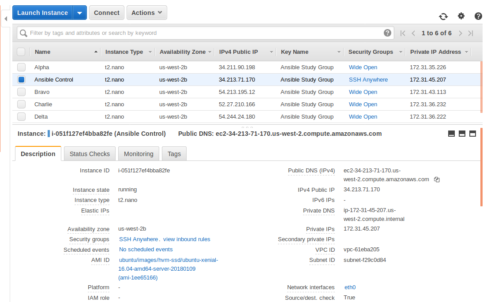

:toc:
:toc-placement!:

:note-caption: :information_source:
:tip-caption: :bulb:
:important-caption: :heavy_exclamation_mark:
:warning-caption: :warning:
:caution-caption: :fire:

= Ansible Study Group Labs
Ron Kurr <rkurr@jvmguy.com>

toc::[]

== Overview
This project is a collection of hands on labs showcasing the use of Ansible.  Unlike other study groups, the learners will have to solve problems with minimal guidance.

TIP: Each lab exercises what was showcased in the video assignments so many of your questions are probably already answered in the video.

IMPORTANT: Each lab builds on the prior ones, so if you are absent from a meeting you need to finish the lab before you can begin any new ones.

== Prerequisites

* an https://aws.amazon.com/[AWS] account
* an SSH client
* familiarity with https://aws.amazon.com/ec2/[EC2]

IMPORTANT: we will be using the same EC2 instances for the labs so always have your SSH key available when we meet.

TIP: Learners running Windows have had good success with http://gitforwindows.org/[Git BASH].

== Lab 01: Setting Up The Testing Environment
In order to give Ansible inventory to work on, we need to setup several small EC2 instances.  In your Amazon account, create the following:

. a new SSH key pair
. an Ubuntu `t2.nano` instance named Ansible Control
. an Ubuntu `t2.nano` instance named Alpha
. an Ubuntu `t2.nano` instance named Bravo
. an Amazon Linux `t2.nano` instance named Charlie
. an Amazon Linux `t2.nano` instance named Delta

IMPORTANT: Ensure that the security group on the instances allows inbound SSH access (port 22).

IMPORTANT: All instances need to have *both* a public and private ip address or packages management will not work!

TIP: Store your SSH keys on a USB stick so you can use different computers to connect to your control instance.

CAUTION: Remember to not use your root account when setting things up.  An Administrator IAM account is highly recommended.

Ansible uses SSH so we need to verify SSH is working as required.

. copy the private half of your SSH key to the control box
. from the control box, ensure you can SSH into Alpha
. from the control box, ensure you can SSH into Bravo
. from the control box, ensure you can SSH into Charlie
. from the control box, ensure you can SSH into Delta
. stop all of your instances

TIP: The `scp` command can be used to upload the key file.

IMPORTANT: SSH is very picky about file permissions so remember to set the proper permissions on the key prior to use.

.AWS Console

== Lab 02: Installing Ansible
. Install the Ansible PPA on the Ansible control box.
. Have Ansible print its version to verify the installation

TIP: The video has the steps as does the Ansible documentation. The documentation is easier to follow.

.Example Output
----
ansible 2.4.3.0
  config file = /etc/ansible/ansible.cfg
  configured module search path = [u'/home/ubuntu/.ansible/plugins/modules', u'/usr/share/ansible/plugins/modules']
  ansible python module location = /usr/lib/python2.7/dist-packages/ansible
  executable location = /usr/bin/ansible
  python version = 2.7.12 (default, Dec  4 2017, 14:50:18) [GCC 5.4.0 20160609]
----

IMPORTANT: Ansible requires that Python2 be installed on all the target machines or many of the modules will not work. On the `Alpha` and `Bravo` install the `software-properties-common` and `python` packages. `Charlie` and `Delta`, being Amazon Linux, already have Python installed.

== Lab 03: Configuring Ansible
. use the `ansible` command to apply the `ping` module to the `alpha` box.  Do *not* use a `hosts` or `ansible.cfg` file, specifying the information using command-line switches instead.
. create an `ansible.cfg` file, specifying the location of your private SSH key
. apply the `ping` module again, using the `ansible.cfg` file this time

TIP: When specifying inventory on the command line, makes sure to have a trailing comma `,`

TIP: Format of the configuration file http://docs.ansible.com/ansible/latest/intro_configuration.html[can be found here].

TIP: Read the documentation to see exactly where configuration files are read from

.Example Output
----
172.31.35.226 | SUCCESS => {
    "changed": false,
    "ping": "pong"
}
----

== Lab 04: Understanding Inventory
. create a `hosts` file with two groups.  One named `ubuntu` and one named `amazon`,  Put `alpha` and `bravo` in the `ubuntu` group and `charlie` and `delta` in the `amazon` group
. apply the `ping` module again, using the `hosts` file this time
. apply the `ping` module, but only to the `ubuntu` group
. apply the `ping` module, but only to the `amazon` group
. create a `blue` group with `alpha` and `charlie` as members and a `green` group with `bravo` and `delta` as members
. apply the `ping` module, but only to the `blue` group
. apply the `ping` module, but only to the `green` group
. apply the `ping` module to the `all` group

TIP: Remember, Ubuntu boxes use `ubuntu` as the user name and Amazon Linux uses `ec2-user`

TIP: A best practice is to specify your machines at the top of the inventory file and create the groups by referencing the machine names.  This avoids duplication of information, easing maintenance.

.Example Output
[source,json]
----
delta | SUCCESS => {
    "changed": false,
    "ping": "pong"
}
charlie | SUCCESS => {
    "changed": false,
    "ping": "pong"
}
bravo | SUCCESS => {
    "changed": false,
    "ping": "pong"
}
alpha | SUCCESS => {
    "changed": false,
    "ping": "pong"
}
----

== Lab 05: Disabling SSH Key Verification
The first time you ssh into a box, you are presented with this warning:

----
The authenticity of host '172.31.43.113 (172.31.43.113)' can't be established.
ECDSA key fingerprint is SHA256:CKohzQOoCI3Gx1rHRBuMgoXfqdPS+gFPCUHbubc/OIc.
Are you sure you want to continue connecting (yes/no)?
----

This is to prevent man-in-the-middle attacks.  Although more secure, this warning does not work well in automated environments.  This is especially true in a cloud environment where machines come and go on an hourly basis.

Modify your `ansible.cfg` file to disable this warning.  To simulate visiting a machine for the first time, test your changes by always removing the `known_hosts` file.  For example,

----
rm -f ~/.ssh/known_hosts && ansible ...
----

You have completed the lab if you can ping all hosts and never see the warning.

----
delta | SUCCESS => {
    "changed": false,
    "ping": "pong"
}
charlie | SUCCESS => {
    "changed": false,
    "ping": "pong"
}
bravo | SUCCESS => {
    "changed": false,
    "ping": "pong"
}
alpha | SUCCESS => {
    "changed": false,
    "ping": "pong"
}
----

== Lab 06: Imply The Inventory File Location
In the previous labs, we have been specifying the inventory file to use.  To simplify the commands, let's tell Ansible which inventory file to use.

Modify `ansible.cfg` so that the inventory file is implied.  You have completed the lab if all hosts can have the `ping` module applied without specifying the inventory file on the command-line.

----
delta | SUCCESS => {
    "changed": false,
    "ping": "pong"
}
charlie | SUCCESS => {
    "changed": false,
    "ping": "pong"
}
bravo | SUCCESS => {
    "changed": false,
    "ping": "pong"
}
alpha | SUCCESS => {
    "changed": false,
    "ping": "pong"
}
----

== Lab 07: Specify Log File Location
Ansible emits a log of the work it performs and you can control the location of that file.

Modify `ansible.cfg` so that the log file is created in the current directory.  You have completed the lab if after you `ping` all hosts, you have a file named `ansible.log` in the current directory and it contains text similar to this:

----
2018-02-07 00:06:51,516 p=32528 u=ubuntu |  delta | SUCCESS => {
    "changed": false,
    "ping": "pong"
}
2018-02-07 00:06:51,538 p=32528 u=ubuntu |  bravo | SUCCESS => {
    "changed": false,
    "ping": "pong"
}
2018-02-07 00:06:51,549 p=32528 u=ubuntu |  alpha | SUCCESS => {
    "changed": false,
    "ping": "pong"
}
2018-02-07 00:06:51,556 p=32528 u=ubuntu |  charlie | SUCCESS => {
    "changed": false,
    "ping": "pong"
}
----

== Lab 08: Bootstrapping Boxes That Need Python Installed
We have already seen that a minimal install of Python2 is required on the target machines in order for Ansible to run its modules.  Installing Python on multiple machines can be tedious and error prone.  It is possible to have Ansible do the work for us by using the http://docs.ansible.com/ansible/latest/raw_module.html[raw] module.

. create a new Ubuntu instance named `Echo` but *do not install Python on it*
. add the new instance to the inventory file, making it part of the `ubuntu` group
. craft an Ansible command-line that uses the `raw` module to install the `software-properties-common` and `python` packages, applying it to the `ubuntu` group

The lab is complete if you see that `echo` gets Python installed but `alpha` and `bravo` don't.

----
bravo | SUCCESS | rc=0 >>
Reading package lists... Done
Building dependency tree
Reading state information... Done
python is already the newest version (2.7.11-1).
software-properties-common is already the newest version (0.96.20.7).
0 upgraded, 0 newly installed, 0 to remove and 14 not upgraded.
Shared connection to 172.31.43.113 closed.

alpha | SUCCESS | rc=0 >>
Reading package lists... Done
Building dependency tree
Reading state information... Done
python is already the newest version (2.7.11-1).
software-properties-common is already the newest version (0.96.20.7).
0 upgraded, 0 newly installed, 0 to remove and 14 not upgraded.
Shared connection to 172.31.35.226 closed.

echo | SUCCESS | rc=0 >>
Reading package lists... Done
Building dependency tree
Reading state information... Done
software-properties-common is already the newest version (0.96.20.7).
The following additional packages will be installed:
  libpython-stdlib libpython2.7-minimal libpython2.7-stdlib python-minimal
  python2.7 python2.7-minimal
Suggested packages:
  python-doc python-tk python2.7-doc binutils binfmt-support
The following NEW packages will be installed:
  libpython-stdlib libpython2.7-minimal libpython2.7-stdlib python
  python-minimal python2.7 python2.7-minimal
0 upgraded, 7 newly installed, 0 to remove and 0 not upgraded.
Need to get 3,908 kB of archives.
After this operation, 16.6 MB of additional disk space will be used.
Get:1 http://us-west-2.ec2.archive.ubuntu.com/ubuntu xenial-updates/main amd64 libpython2.7-minimal amd64 2.7.12-1ubuntu0~16.04.2 [338 kB]
Get:2 http://us-west-2.ec2.archive.ubuntu.com/ubuntu xenial-updates/main amd64 python2.7-minimal amd64 2.7.12-1ubuntu0~16.04.2 [1,294 kB]
Get:3 http://us-west-2.ec2.archive.ubuntu.com/ubuntu xenial/main amd64 python-minimal amd64 2.7.11-1 [28.2 kB]
Get:4 http://us-west-2.ec2.archive.ubuntu.com/ubuntu xenial-updates/main amd64 libpython2.7-stdlib amd64 2.7.12-1ubuntu0~16.04.2 [1,880 kB]
Get:5 http://us-west-2.ec2.archive.ubuntu.com/ubuntu xenial-updates/main amd64 python2.7 amd64 2.7.12-1ubuntu0~16.04.2 [224 kB]
Get:6 http://us-west-2.ec2.archive.ubuntu.com/ubuntu xenial/main amd64 libpython-stdlib amd64 2.7.11-1 [7,656 B]
Get:7 http://us-west-2.ec2.archive.ubuntu.com/ubuntu xenial/main amd64 python amd64 2.7.11-1 [137 kB]
Fetched 3,908 kB in 0s (26.2 MB/s)
Selecting previously unselected package libpython2.7-minimal:amd64.
(Reading database ... 51121 files and directories currently installed.)
Preparing to unpack .../libpython2.7-minimal_2.7.12-1ubuntu0~16.04.2_amd64.deb ...
Unpacking libpython2.7-minimal:amd64 (2.7.12-1ubuntu0~16.04.2) ...
Selecting previously unselected package python2.7-minimal.
Preparing to unpack .../python2.7-minimal_2.7.12-1ubuntu0~16.04.2_amd64.deb ...
Unpacking python2.7-minimal (2.7.12-1ubuntu0~16.04.2) ...
Selecting previously unselected package python-minimal.
Preparing to unpack .../python-minimal_2.7.11-1_amd64.deb ...
Unpacking python-minimal (2.7.11-1) ...
Selecting previously unselected package libpython2.7-stdlib:amd64.
Preparing to unpack .../libpython2.7-stdlib_2.7.12-1ubuntu0~16.04.2_amd64.deb ...
Unpacking libpython2.7-stdlib:amd64 (2.7.12-1ubuntu0~16.04.2) ...
Selecting previously unselected package python2.7.
Preparing to unpack .../python2.7_2.7.12-1ubuntu0~16.04.2_amd64.deb ...
Unpacking python2.7 (2.7.12-1ubuntu0~16.04.2) ...
Selecting previously unselected package libpython-stdlib:amd64.
Preparing to unpack .../libpython-stdlib_2.7.11-1_amd64.deb ...
Unpacking libpython-stdlib:amd64 (2.7.11-1) ...
Processing triggers for man-db (2.7.5-1) ...
Processing triggers for mime-support (3.59ubuntu1) ...
Setting up libpython2.7-minimal:amd64 (2.7.12-1ubuntu0~16.04.2) ...
Setting up python2.7-minimal (2.7.12-1ubuntu0~16.04.2) ...
Linking and byte-compiling packages for runtime python2.7...
Setting up python-minimal (2.7.11-1) ...
Selecting previously unselected package python.
(Reading database ... 51867 files and directories currently installed.)
Preparing to unpack .../python_2.7.11-1_amd64.deb ...
Unpacking python (2.7.11-1) ...
Processing triggers for man-db (2.7.5-1) ...
Setting up libpython2.7-stdlib:amd64 (2.7.12-1ubuntu0~16.04.2) ...
Setting up python2.7 (2.7.12-1ubuntu0~16.04.2) ...
Setting up libpython-stdlib:amd64 (2.7.11-1) ...
Setting up python (2.7.11-1) ...
Warning: Permanently added '172.31.43.102' (ECDSA) to the list of known hosts.
Shared connection to 172.31.43.102 closed.
----

== Lab 09: Run Plays Locally
Much of the time, Ansible will be operating on remote machines but sometimes Ansible needs to operate on the control host. In this lab, we will learn proper command-line switches that are needed to have Ansible operate against the local machine.

. learn about the `setup` module but *do not use your web browser*!
. create a command-line that will apply the `setup` module against the local machine
. create a command-line that will apply the `setup` module against the local machine, only returning the minimum information
. create a command-line that will apply the `setup` module against the local machine, returning only the attributes starting with `ansible_distribution`

TIP: Read the *entire* help entry

You have completed the lab if Ansible reports something similar to this:

----
localhost | SUCCESS => {
    "ansible_facts": {
        "ansible_distribution": "Ubuntu",
        "ansible_distribution_file_parsed": true,
        "ansible_distribution_file_path": "/etc/os-release",
        "ansible_distribution_file_variety": "Debian",
        "ansible_distribution_major_version": "16",
        "ansible_distribution_release": "xenial",
        "ansible_distribution_version": "16.04"
    },
    "changed": false
}
----

== Lab 10: Install Apache (ad-hoc)
. learn about the `yum` module
. learn about the `apt` module
. learn about the `service` module
. install the latest `apache2` package on the `ubuntu` servers
. install the latest `httpd` package on the `amazon` servers
. start the `apache2` service on the `ubuntu` servers
. start the `httpd` service on the `amazon` servers

You have completed the lab if you can connect your web browser to the *public* ips of all your servers.  Apache should send back a "welcome" page.

TIP: Ubuntu and Amazon Linux use *different* package managers

TIP: The state of the service should be `started` and enabled

TIP: Packages can only be installed by a *privileged* user

== Lab 11: Simplest Playbook (manually)
. learn about the `debug` module
. create a playbook named `lab-11.yml` that applies the `debug` module to all inventory
. the message can be anything you want

You have completed the lab if Ansible reports something similar to this:

----
PLAY [Exercise Debug Module] ***************************************************************************************************************

TASK [Gathering Facts] *********************************************************************************************************************
ok: [delta]
ok: [charlie]
ok: [bravo]
ok: [echo]
ok: [alpha]

TASK [Print Hello] *************************************************************************************************************************
ok: [alpha] => {
    "msg": "Ron was here!"
}
ok: [bravo] => {
    "msg": "Ron was here!"
}
ok: [charlie] => {
    "msg": "Ron was here!"
}
ok: [delta] => {
    "msg": "Ron was here!"
}
ok: [echo] => {
    "msg": "Ron was here!"
}

PLAY RECAP *********************************************************************************************************************************
alpha                      : ok=2    changed=0    unreachable=0    failed=0
bravo                      : ok=2    changed=0    unreachable=0    failed=0
charlie                    : ok=2    changed=0    unreachable=0    failed=0
delta                      : ok=2    changed=0    unreachable=0    failed=0
echo                       : ok=2    changed=0    unreachable=0    failed=0
----

TIP: Indentation matters. I use 4 space indents to make the scoping obvious.

TIP: We use a different Ansible command when running playbooks.

== Lab 00: Copying Files via Playbook
== Lab 00: Copying Templated Files
== Lab 00: Conditionally Copying Files Based On Distribution

== License and Credits
This project is licensed under the https://creativecommons.org/licenses/by-nc-sa/4.0/legalcode[Creative Commons Attribution-NonCommercial-ShareAlike 4.0 International License].
